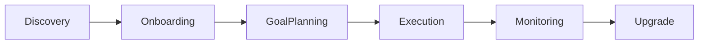

# KingCL AI Growth Planner — UI-Only Mockup Specification

> Version: 1.0 • Scope: UI specification only (no backend) • Audience: Product, Design, Frontend

## 1) Product Summary
KingCL AI Growth Planner는 직장인들이 개인 성장 목표를 설정·관리하고, AI 기반 코칭으로 실행력을 높이는 웹 SaaS입니다. 핵심 기능은 AI 루틴 자동화 플래너, GPT 성장 코치 챗봇, 성장 대시보드입니다.

## 2) Target Users
- Primary: 20~40대 지식 노동자(개발, 마케팅, 기획 등)
- Secondary: 소규모 HR 팀 관리자(팀 성장 데이터 관리)

## 3) Design Mood & Principles
- Modern, Professional, Motivational
- 넉넉한 여백, 명확한 위계, 친근한 마이크로 인터랙션
- 접근성: AA 대비(contrast) 이상, 키보드 네비게이션 보장

## 4) Color & Typography Guidelines
- Color: T-001 정의 토큰 사용 (Primary / Secondary / Accent / Grayscale)
- Spacing: 8px base grid
- Typography: H1–H6, Body, Caption 위계 구성 (시멘틱 태그 준수)
- Icon: lucide-react, 일관된 stroke-width(일반 1.5–2)

## 5) User Journey

## 6) Sitemap (Routes & Roles)
- / (Landing) — unauthenticated
- /dashboard (User) — 성장 대시보드
- /planner (User) — AI 루틴 자동화 플래너
- /coach (User) — GPT 성장 코치 챗봇
- /team (Team Admin) — 팀 대시보드 & 멤버 관리
- /settings (User/Admin) — 프로필 & 요금제

## 7) Global Layout Components
- Header: 로고, 글로벌 내비, Theme toggle, 유저 메뉴
- Sidebar: Collapsible(데스크톱 기본 표시, 태블릿 접기, 모바일 햄버거)
- Content: 페이지별 주요 컨텐츠 래퍼
- Footer: 저작권, 간단 링크
- Responsive: Desktop(≥1280) / Tablet(768–1279) / Mobile(<768)

## 8) Common Components (UI-only)
- Buttons: Primary / Secondary / Text
- Cards: 상태 카드, 차트 카드(placeholder 이미지), 정보 카드
- Forms: TextField, Select, Checkbox, Switch, Tabs, Dialog
- Toast: 작업 성공/에러 알림

## 9) Page Guidelines (UI Skeletons)

### 9.1 Dashboard (/dashboard)
- Core Purpose: 목표 달성 현황 한눈에 보기
- Layout: 2-column grid + collapsible sidebar
- Key Widgets:
  - 목표 완료 현황 카드(숫자 강조)
  - 주간/월간 트렌드 차트 카드(placeholder image 사용)
  - 최근 활동/추천 액션 리스트
- Empty State: "목표를 생성해 시작해 보세요"

### 9.2 Planner (/planner)
- Core Purpose: 자동 생성된 일일/주간/월간 할 일 확인 및 체크
- Layout: Full-width header + Tabs(Daily/Weekly/Monthly)
- Components: 체크리스트 아이템, 필터, 완료 토글, 진행률 표시
- Empty State: "아직 생성된 루틴이 없어요. 목표를 추가해 보세요"

### 9.3 Coach (/coach)
- Core Purpose: GPT 성장 코치 대화 인터페이스
- Layout: 채팅 패널(메시지 리스트 + 입력창), 우측 팁 카드(optional)
- UI: 사용자/코치 말풍선 구분, 로딩 상태, 제안 프롬프트 칩

### 9.4 Team (/team)
- Core Purpose: 팀 개요, 멤버 관리, 권한/역할 보기
- Layout: 목록 테이블 + 멤버 초대 Dialog
- Empty State: "아직 팀이 없습니다. 팀을 생성해 보세요"

### 9.5 Settings (/settings)
- Core Purpose: 프로필, 알림, 요금제 관리
- Layout: 좌측 탭 내비(프로필/보안/요금제) + 우측 내용

## 10) Wireframe Sketches (Textual)

Dashboard
- Header[Logo | Nav]  UserMenu
- Sidebar[Dashboard/Planner/Coach/Team/Settings]
- Content
  - Row1: [KPI Card][KPI Card]
  - Row2: [Trend Chart Placeholder (picsum.photos)][Recommendations]

Planner
- Header[Title + Tabs: Daily | Weekly | Monthly]
- Content
  - Checklist items with Checkbox | Title | Badge | Menu

Coach
- Chat List (alternating bubbles)
- Input bar with send

## 11) Accessibility & States
- Focus ring: 명확한 표시(테마 색상 바운더리)
- States: hover/active/disabled/loading 정의
- Keyboard: Tab 순서, Skip to content 링크

## 12) Data & Copy
- 현재 단계에서는 더미 데이터 사용 (API 연동 없음)
- 모든 차트 이미지는 https://picsum.photos/seed/chart/800/360 등 사용

## 13) Routing Requirements
- 모든 상기 경로는 클라이언트 라우팅으로 동작해야 함
- 루트 / 정상 진입 가능해야 함

---

본 문서는 UI 목업 명세입니다. 기능 구현/백엔드 연동 없이 화면 구조·컴포넌트·라벨·상태만을 정의합니다.
